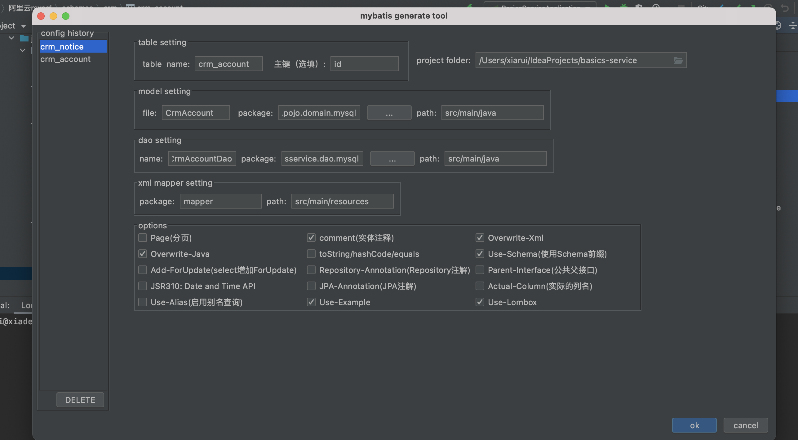

## idea 安装 free mybatis plugin
打开idea,打开一个项目,在右侧database视图，新建一个数据库连接

在表名上右键，点击mybatis-generator



model setting file控制实体类名 CrmAccount.java

model setting package 控制存储的位置 例如 com.zhonghe.basicsservice.pojo.domain.mysql

dao setting file 控制 CrmAccountDao.java

dao setting package 控制存储的位置 例如 com.zhonghe.basicsservice.dao.mysql

xml mapper setting package 控制存储位置 例如mapper

默认会勾选 overwrite-java、comment(注释)、overwrite-xml、use-schema、use-lombox

勾选use-example  会生成查询条件工具类，进行单表的条件查询


1. model setting file控制实体类名 CrmOceanDropConfig.java
```java
package com.zhonghe.basicsservice.pojo.domain.mysql;

import java.io.Serializable;
import java.util.Date;
import lombok.Data;

/**
 * crm_ocean_drop_config
 * @author 
 */
@Data
public class CrmOceanDropConfig implements Serializable {
    private Integer id;

    private String mongodbId;

    private Integer departmentNo;

    /**
     * new: 新数据掉入公海配置，assigned: 自分配数据掉入公海配置
     */
    private String type;

    /**
     * 未分配时间 单位 ms
     */
    private Integer unProcessed;

    /**
     * 已处理时间 单位 ms
     */
    private Integer processed;

    /**
     * 已处理但未成交时间  单位 ms
     */
    private Integer unDeal;

    /**
     * 已成交客户时间  单位ms
     */
    private Integer deal;

    /**
     * 每天可认领数量 单位 个
     */
    private Integer dailyClaimCount;

    private Date createdAt;

    private Date updatedAt;

    private static final long serialVersionUID = 1L;
}
```
得到的是和数据库的映射关系

2. dao setting file 控制 CrmOceanDropConfigDao.java
```java
package com.zhonghe.basicsservice.dao.mysql;

import com.zhonghe.basicsservice.pojo.domain.mysql.CrmOceanDropConfig;
import com.zhonghe.basicsservice.pojo.domain.mysql.CrmOceanDropConfigExample;
import java.util.List;
import org.apache.ibatis.annotations.Param;

public interface CrmOceanDropConfigDao {
    long countByExample(CrmOceanDropConfigExample example);

    int deleteByExample(CrmOceanDropConfigExample example);

    int deleteByPrimaryKey(Integer id);

    int insert(CrmOceanDropConfig record);

    int insertSelective(CrmOceanDropConfig record);

    List<CrmOceanDropConfig> selectByExample(CrmOceanDropConfigExample example);

    CrmOceanDropConfig selectByPrimaryKey(Integer id);

    int updateByExampleSelective(@Param("record") CrmOceanDropConfig record, @Param("example") CrmOceanDropConfigExample example);

    int updateByExample(@Param("record") CrmOceanDropConfig record, @Param("example") CrmOceanDropConfigExample example);

    int updateByPrimaryKeySelective(CrmOceanDropConfig record);

    int updateByPrimaryKey(CrmOceanDropConfig record);

    // 自定义方法
    List<CrmContactPending> reserveList(StudentListSearchDto record);
}
```
得到的是操作数据库的接口, 可以在这里自定义方法，进行表关联查询，自定义的方法id需要映射到mapper下的xml文件
```xml
<select id="reserveList" parameterType="com.zhonghe.userim.pojo.dto.student.StudentListSearchDto"
          resultMap="BaseResultMap">
    select
    ccp.*,
    `crm_follow`.next_contact_time as nextContactTime, `crm_follow`.status
    from `crm_contact_pending` ccp
    inner join `crm_follow`
    on ccp.last_follow_id = crm_follow.id
    <where>
      <if test="mobile != null">
        AND ccp.mobile = #{mobile}
      </if>
      <if test="followCountEnd != null">
        AND #{followCountEnd} >= ccp.follow_count
      </if>
      <if test="followCountStart != null">
        AND ccp.follow_count >= #{followCountStart}
      </if>
      AND crm_follow.next_contact_time >= NOW()
      <if test="nextContactTimeStart != null and nextContactTimeEnd != null">
        AND crm_follow.next_contact_time between #{nextContactTimeStart} and #{nextContactTimeEnd}
      </if>
    </where>
  </select>
```

## MyBatis Generator 生成的example 使用 and or 简单混合查询
```java
CrmStudentExample example = new CrmStudentExample();

CrmStudentExample.Criteria condition1 = example.or().andFollowerDepartmentNoIn(curAdmin.getAvailableDepartmentNos())
        .andStatusIn(unStatus).andFallintoOceanTimeBetween(new Date(), calendar.getTime());

calendar.add(calendar.DATE, 2);
CrmStudentExample.Criteria condition2 = example.or().andFollowerDepartmentNoIn(curAdmin.getAvailableDepartmentNos())
        .andStatusIn(otherStatus).andFallintoOceanTimeBetween(new Date(), calendar.getTime());

// 如果是销售专员,将follower.no设置为自己
if (EnumRole.isSeller(curAdmin.getRoleId()) || curAdmin.getSingleData()) {
    condition1.andFollowerNoEqualTo(curAdmin.getNo());
    condition2.andFollowerNoEqualTo(curAdmin.getNo());
}

// 设置orderBy
example.setOrderByClause("fallintoOceanTime asc");

// 设置dis
return example;
```