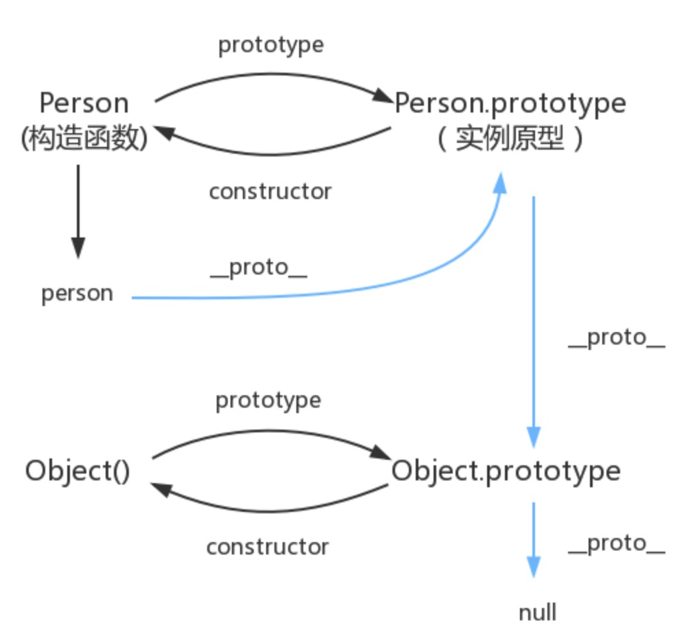

> Prototype-based Object Inheritance JavaScript supports object inheritance via something known as prototype. There is an object property called prototype attached to each object.
JS 通过prototype支持对象的继承。

> Working with class and extends keywords is easy - but actually understanding how prototype-based inheritance works is not trivial.
在 ES2015/ES6 中引入了 class 关键字，但那只是语法糖，JavaScript 仍然是基于原型的


## ES5 中的构造函数相关内容
在JavaScript中，每个函数都有一个prototype属性，这个属性指向函数的原型对象,
而这个原型对象正是调用 构造函数 创建实例时的原型
```js
// Define a Bird 构造函数
function Bird(type, color) {
    this.type = type;
    this.color = color;
    this.eggs = 0;

    this.fly = function() {
        console.log(`${this.color} ${this.type} is flying!`)
    }

    this.lay_egg = function() {
        this.eggs ++;
        console.log(`${this.color} ${this.type} is laid an egg!`)
    }
}

const bird = new Bird("黄鹂","yellow")
console.log(bird.__proto__ === Bird.prototype) // true
console.log(Bird === Bird.prototype.constructor) // true


// You could have alternatively attached the lay egg method directly to 
// Bird.prototype as shown in the next example:
// Define method lay_egg() via prototype property
Bird.prototype.lay_egg = function() {
    this.eggs ++;
    console.log(`${this.color} ${this.type} is laid an egg!`)
}

Bird.prototype.size = "middle";

// 实例bird与原型Bird关系：当读取实例的属性时，如果找不到，就会查找与对象关联的原型中的属性，如果还查不到，就去找原型的原型
bird.size = "little"
console.log(bird.size) // little

delete bird.size
console.log(bird.size) // middle

// Let’s create a Parrot and inherit it from Bird:
function Parrot(type,color) {
    // We must call parent constructor and pass this to it 
    Bird.call(this, type, color);
    this.talk = function() {
        console.log(`${this.color} ${this.type} is talking!`)
    }
}

// Now parrot can fly, walk, lay eggs and talk! 
// But we never had to define fly walk and lay_eggs methods inside Parrot itself.

// 创建一个Parrot的实例 parrot1
const parrot1 = new Parrot();
parrot1.talk()
```

## ES6 class extends
ES6 Luckily we now have class and extends keywords to accomplish exactly the same thing 
we just did in the previous section.
Define a Bird Class
```js
class Bird {
    constructor(type, color) {
        this.type = type;
        this.color = color;
    }

    fly () {}

    lay_egg () {}
}

class Parrot extends Bird {
    constructor(type, color) {
        super(type, color);
        this.type = type;
        this.color = color;
    }

    talk() { console.log('Parrot is talking!') };
}
```

## 原型链
以上证明了
```js
console.log(bird.__proto__ === Bird.prototype) // true
console.log(Bird === Bird.prototype.constructor) // true
```


其实原型对象就是通过 Object 构造函数生成的，结合之前所讲，实例的 __proto__ 指向构造函数的 prototype 

简单的回顾一下构造函数、原型和实例的关系：每个构造函数都有一个原型对象，原型对象都包含一个指向构造函数的指针，而实例都包含一个指向原型对象的内部指针。那么假如我们让原型对象等于另一个类型的实例，结果会怎样？显然，此时的原型对象将包含一个指向另一个原型的指针，相应地，另一个原型中也包含着一个指向另一个构造函数的指针。假如另一个原型又是另一个类型的实例，那么上述关系依然成立。如此层层递进，就构成了实例与原型的链条。这就是所谓的原型链的基本概念。——摘自《javascript高级程序设计》

那 Object.prototype 的原型呢？
```js
console.log(Object.prototype.__proto__ === null) // true
```
所以查找属性的时候查到 Object.prototype 就可以停止查找了。
图中由相互关联的原型组成的链状结构就是原型链，也就是蓝色的这条线。

## 参考链接
https://developer.mozilla.org/zh-CN/docs/Web/JavaScript/Inheritance_and_the_prototype_chain
https://medium.com/awebdeveloper/inheritance-in-javascript-608b263be29f
[A Guide To Prototype-Based Class Inheritance In JavaScript](https://medium.com/@js_tut/a-guide-to-prototype-based-class-inheritance-in-javascript-849d3c3ddca)

https://www.cnblogs.com/loveyaxin/p/11151586.html